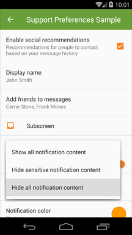
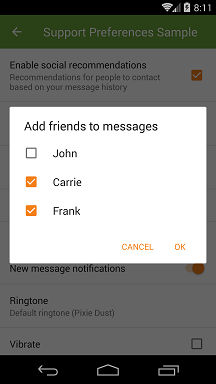
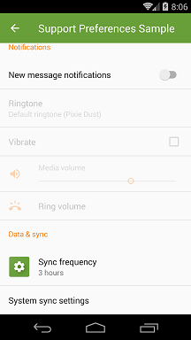

# Material Preference [ ](https://bintray.com/consp1racy/maven/net.xpece.android%3Asupport-preference/_latestVersion) [ ](https://android-arsenal.com/details/1/3267)


Material theme for preference widgets.

Backporting dat material look *and* functionality.

Available from API 9. *Connecting preference-v7 to appcompat-v7.*

## Table of contents
- [How to get the library?](#how-to-get)
- [Screenshots](#screenshots)
- [Contents](#contents)
- [How to use the library?](#how-to-use)
- [Changelog](CHANGELOG.md)

<a name="how-to-get"/>

## How to get the preference library? <a href="http://www.methodscount.com/?lib=net.xpece.android%3Asupport-preference%3A1.2.0"></a> <a href="http://www.methodscount.com/?lib=com.android.support%3Apreference-v7%3A25.0.1"></a>


```groovy
dependencies {
    compile 'net.xpece.android:support-preference:1.2.5'
    
    ext.supportLibsVersion = "25.1.0"
    compile "com.android.support:appcompat-v7:$supportLibsVersion"
    compile "com.android.support:preference-v7:$supportLibsVersion"
}
```

Always specify `preference-v7` version explicitly!

## How to get color picker preference too? <a href="http://www.methodscount.com/?lib=net.xpece.android%3Asupport-preference-color%3A1.0.0"></a>


```groovy
dependencies {
    compile 'net.xpece.android:support-preference-color:1.0.0'
}
```

## How to get just custom Material popup menu and spinner? <a href="http://www.methodscount.com/?lib=net.xpece.android%3Asupport-spinner%3A1.0.0"></a>


```groovy
dependencies {
    compile 'net.xpece.android:support-spinner:1.2.4'
}
```

<a name="screenshots"/>

## Screenshots

Library version 0.6.0. Android version 4.4.

Showcasing simple menu/dialog, custom title and summary text appearance and color picker.

&nbsp;
&nbsp;
&nbsp;

Library version 0.5.1. Android version 4.4.

&nbsp;
&nbsp;
&nbsp;
&nbsp;
&nbsp;
&nbsp;
&nbsp;
&nbsp;
&nbsp;

<a name="contents"/>

## Contents

### Support preference

- `Preference`
- `CheckBoxPreference`
- `SwitchPreference`
    - Using `SwitchCompat` available from API 7
- `DialogPreference`
    - Uses AppCompat AlertDialog Material theme
- `EditTextPreference`
- `ListPreference`
    - Optionally can display as a simple menu or simple dialog.
    - Subclasses support custom adapter.
- `MultiSelectListPreference`
    - Available since API 7
- `SeekBarDialogPreference` extends `DialogPreference`
    - Made public
- `SeekBarPreference`
    - Made public
    - According to http://www.google.com/design/spec/components/dialogs.html#dialogs-confirmation-dialogs
- `RingtonePreference`
    - Coerced Ringtone Picker Activity from AOSP
- `XpPreferenceFragment`
    - Handles proper Preference inflation and DialogPreference dialogs
- `SharedPreferencesCompat`
    - `getStringSet` and `putStringSet` methods allow persisting string sets even before API 11
- `XpPreferenceManager`
    - `setDefaultValues` method takes into account preference classes in custom packages
- `XpPreferenceHelpers`
    - Tinted icons and text appearance support for preferences outside of this library
    
### Support color preference

- `ColorPreference`
    - Pillaged http://www.materialdoc.com/color-picker/

### Support spinner

Spinner, popup menu and adapters behaving according to Material Design specs.
Read https://www.google.com/design/spec/components/menus.html#menus-behavior.

- `XpAppCompatSpinner`
  - `Spinner` variant that uses simple menu or simple dialog.
- `XpListPopupWindow`
  - Popup window that supports minimum distance from edges,
  multiple size measuring modes, `ListView` padding etc.
- `CheckedTypedItemAdapter<T>`
  - `ListAdapter` plus `SpinnerAdapter` that highlights one item.
  - Open methods for converting `T` to `CharSequence`.
  - Allows different string representations for selected spinner item and drop down menu.

## Features on top of preference-v7

- Using appcompat-v7 features.
- Material preference item layouts out of the box.
- Icon and dialog icon tinting and padding.
- <s>`EditTextPreference` understands `EditText` XML attributes.</s>
  - Use `EditTextPreference.setOnCreateEditTextListener(OnCreateEditTextListener)` to setup your input field.
- Several preference widgets not publicly available in preference-v7 or SDK.
    - `RingtonePreference`, `SeekBarPreference`, `SeekBarDialogPreference`, `MultiSelectListPreference`
- Subscreen navigation implementation.
- `ListPreference` can optionally show as a simple menu in a popup instead of a dialog.
- `ColorPreference`
- Preference long click listeners.
- Title/summary text color and text appearance defined in Java or XML.

<a name="how-to-use"/>

## How to use the library?

### Basic setup

Your preference fragment needs to extend `XpPreferenceFragment`.

Setup your preference items in the following method:

```java
public void onCreatePreferences2(final Bundle savedInstanceState, final String rootKey) {
    // ...
}
```

Your settings activity theme *needs to* specify the following values:

```xml
<style name="AppTheme" parent="Theme.AppCompat.Light.NoActionBar">
    <!-- Used to theme preference list and items. -->
    <item name="preferenceTheme">@style/PreferenceThemeOverlay.Material</item>
    <!-- Default icon tint for preferences. -->
    <item name="asp_preferenceIconTint">?colorAccent</item>
    <item name="asp_preferenceDialogIconTint">?asp_preferenceIconTint</item>
</style>
```

Recommended tint colors are `?colorAccent` or `?colorControlNormal`.

Styling `alertDialogTheme` is recommended for a proper color theme. See the sample project.

### Dividers

Preference-v7 r23.2.0 provides a divider implementation out of the box.
If you want to customize how this divider looks you can call `setDivider(...)` and `setDividerHeight(...)`.
Preference-v7 divider will be drawn just between items and at the bottom of the list. It will not be drawn before the end of category.

If you want more control over where the dividers are drawn, disable the default implementation and use my own instead:

```java
@Override
public void onViewCreated(View view, Bundle savedInstanceState) {
    super.onViewCreated(view, savedInstanceState);
    getListView().addItemDecoration(new PreferenceDividerDecoration(getContext()).drawBottom(true));
    setDivider(null);
}
```

Preference-v7 r23.1.1 does not provide a default divider so you don't need to call `setDivider(null)`.

### Ringtone picker

`RingtonePicker` will show only system ringtones/notification sounds by default.
If you want to include sounds from the external storage your app needs to request
`android.permission.READ_EXTERNAL_STORAGE` permission in its manifest.
Don't forget to check this runtime permission before opening ringtone picker on API 23.

### ListPreference custom adapter

If you subclass `ListPreference` you can supply your own `SpinnerAdapter` which may or may not
use `getEntries()` as its data set. Here follow the methods you need to override:
- `SpinnerAdapter buildSimpleMenuAdapter(Context)` - Used in simple menus.
- `SpinnerAdapter buildSimpleDialogAdapter(Context)` - Used in simple dialogs.
- Override the following methods if your `SpinnerAdapter` does *not* use `getEntries()` as data set:
  - `CharSequence[] getEntries()` - Item captions.
  - `CharSequence[] getEntryValues()` - Persisted item values.

### Simple menu and Simple dialog

Simple menu is described in [Material Design specs](https://www.google.com/design/spec/components/menus.html#menus-simple-menus).

If you want to show your `ListPreference` in a popup instead of a dialog use this configuration:

```xml
<ListPreference
    style="@style/Preference.Material.DialogPreference.ListPreference.SimpleMenu"/>
```

Above code will ensure that:
- If all items fit on one line a popup window is shown.
- Otherwise a simple dialog is shown.
- Popup window width will round up to nearest multiply of 56dp on phones and 64dp on tablets.

These are the attributes and values for manual setup:

Attribute | Values | Description
--- | --- | ---
`app:asp_menuMode` | `dialog` | *Default behavior.* Alert dialog with radio buttons and optional window title.
 | `simple_menu` | Menu is shown in a popup window. Selected option is highlighted. Less disruptive than dialog.
 | `simple_dialog` | Menu is shown in a dialog with no other controls. Selected option is highlighted.
 | `simple_adaptive` | Menu is shown in a popup window if it contains single line items only . Otherwise simple dialog is shown.
`app:asp_simpleMenuWidthUnit` | `0dp` | *Default behavior.* Popup window width is determined by the width of its content.
 | `*X*dp` | Popup width is determined by the width of its content and rounded up to the nearest multiply of *X*dp.
 | `match_parent`</br>`wrap_content` | Popup width will stretch to match underlying `ListPreference` width.

### Material Spinner


New `XpAppCompatSpinner` widget is built according to
[Material Design specs](https://www.google.com/design/spec/components/menus.html#menus-behavior).

> Menus are positioned over their emitting elements such that the currently selected menu item appears on top of the emitting element.

Example setup:

```xml
<net.xpece.android.support.widget.XpAppCompatSpinner
    style="@style/Widget.Material.Spinner.Underlined"
    android:theme="ThemeOverlay.Material.Spinner"
    android:layout_width="wrap_content"
    android:layout_height="wrap_content"
    android:entries="@array/my_entries"
    app:asp_spinnerMode="dialog|dropdown|adaptive"/>
```

The above setup will ensure the following:

- Popup `ListView` will have top and bottom padding.
  - Theme overlay applied via `android:theme` directly limits its effects on this widget.
  - Is not supported by AppCompat or platform popup windows.
- `Spinner` will have proper space around its caret before API 23.
  - If using `style="@style/Widget.Material.Spinner"` or `style="@style/Widget.Material.Spinner.Underlined"`.

If you need to alter entries programmatically create by `CheckedItemAdapter.newInstance(Context, CharSequence[], int)`
or supply your own adapter (responsible for its own styling) to `XpAppCompatSpinner.setAdapter(SpinnerAdapter)`.

Attribute | Values | Description
--- | --- | ---
`app:asp_spinnerMode` | `dropdown` | Menu is shown in a popup window. Selected option is highlighted. Less disruptive.
 | `dialog` | Menu is shown in a dialog with no other controls. Selected option is highlighted.
 | `adaptive` | *Default behavior.* Menu is shown in a popup window if it contains only single line items. Otherwise simple dialog is shown.
`app:asp_simpleMenuWidthUnit` | `0dp` | *Default behavior.* Popup window width is determined by the width of its content.
 | `Xdp` | Popup width is determined by the width of its content and rounded up to the nearest multiply of *X*dp.
 | `match_parent`</br>`wrap_content` | Popup width will stretch to match underlying `ListPreference` width.

### Color preference

Version 0.6.0 introduced color preference as a separate module. An example would look like this:

```xml
<ColorPreference
    android:defaultValue="?colorPrimary"
    android:entries="@array/colors_material_names"
    android:entryValues="@array/colors_material"
    android:key="notif_color"
    android:title="Notification color"/>

<array name="colors_material">
     <item>@color/material_red_500</item>
     <item>@color/material_light_blue_500</item>
     <item>@color/material_light_green_500</item>
     <item>@color/material_orange_500</item>
</array>

<string-array name="colors_material_names">
    <item>Red</item>
    <item>Light Blue</item>
    <item>Light Green</item>
    <item>Orange</item>
</string-array>
```

Attributes include:

Attribute | Values | Description
--- | --- | ---
`android:entryValues` | Array of colors | Specifies an array of colors to display.
`android:entries` | Array of text | Specifies textual description of each color.
`app:asp_columnCount` | Integer | Specifies the number of columns in the color picker. Use an integer resource which will allow you to specify greater number on tablets. *Default is `4`.*
 | `-1` | Number of columns will be computed automatically to fill space available in window.
`app:asp_swatchSize` | `small` | *Default option.* Swatches will be 48dp in width and height plus 4dp margin on each side.
 | `large` | Swatches will be 64dp in width and height plus 8dp margin on each side.

Finally you need to make your preference fragment fire up the color picker dialog
when the preference is clicked and optionally update summary when a color is chosen.
Please review sample [`SettingsActivity.java`](sample/src/main/java/net/xpece/android/support/preference/sample/SettingsActivity.java)
and [`SettingsFragment.java`](sample/src/main/java/net/xpece/android/support/preference/sample/SettingsFragment.java) respectively.

If you need to change the default style either use `style` attribute or override it in your theme:

```xml
<item name="colorPreferenceStyle">@style/Preference.Material.DialogPreference.ColorPreference</item>
```

The color is stored internally as a 32-bit integer.

### Subscreen navigation

Possible solution is implemented in `PreferenceScreenNavigationStrategy.ReplaceFragment` class.
This class will help you replace the whole preference fragment with a new instance with specified root preference.
It is using fragment transactions and back stack allowing for transition animations and saved states.

### Known issues with support library

In appcompat-v7 r23.1.1 and r24.1.x there is a bug which prevents tinting of checkmarks in lists.
Call `Fixes.updateLayoutInflaterFactory(getLayoutInflater())` right after
`super.onCreate(savedInstanceState)` in your Activity.

```java
@Override
protected void onCreate(Bundle savedInstanceState) {
    super.onCreate(savedInstanceState);
    Fixes.updateLayoutInflaterFactory(getLayoutInflater());
    setContentView(R.layout.activity_settings);
    //...
}
```

---

You may have experienced unexpected background color which manifests as holo blue on Android 4 and grey on Android 5.
This is caused by `PreferenceFragment`'s `RecyclerView` grabbing focus on fragment start.
We can disable this behavior while still being able to navigate between individual preferences with a D-pad.

    @Override
    public void onViewCreated(View view, @Nullable Bundle savedInstanceState) {
        super.onViewCreated(view, savedInstanceState);
        final RecyclerView listView = getListView();

        // We don't want this. The children are still focusable.
        listView.setFocusable(false);
    }

### Icon tinting

All preferences:

- `app:asp_tint`
- `app:asp_tintMode`
- `app:asp_tintEnabled`

All dialog preferences:

- `app:asp_dialogTint`
- `app:asp_dialogTintMode`
- `app:asp_dialogTintEnabled`

### Icon padding

Application icons (48dp x 48dp) require no extra padding.
For smaller icons extra padding of 4dp on each side is needed.
Achieve this by using `app:asp_iconPaddingEnabled`
and `app:asp_dialogIconPaddingEnabled` attributes. Icon padding is enabled by default.

### Handling PreferenceScreen icons

As `PreferenceScreen` class is final and hardwired into preference system
I was unable to automate icon tinting and padding. However you are able to do this yourself:

```java
Preference subs = findPreference("subs_screen");
PreferenceIconHelper subsHelper = new PreferenceIconHelper(subs);
subsHelper.setIconPaddingEnabled(true); // Call this BEFORE setIcon!
subsHelper.setIcon(R.drawable.some_icon);
subsHelper.setTintList(AppCompatResources.getColorStateList(subs.getContext(), R.color.accent));
subsHelper.setIconTintEnabled(true);
/* or */
PreferenceIconHelper.setup(subs /* preference */,
    R.drawable.some_icon /* icon */,
    R.color.accent /* tint */,
    true /* padding */);
```

You can use this class even on preference classes from preference-v7 package in case you're not using
`XpPreferenceFragment`.

### Proguard

Since version 0.5.1 Proguard rules are bundled with the library.

## Changelog

See [CHANGELOG.md](CHANGELOG.md).

## Known issues

- MultiSelectListPreference items may be incorrectly tinted on Android 2.
  - Observed on Android 4 as well on first opening of multi select dialog.

## Questions

- Why are some of your classes in `android.support.v7` packages?
    - I'm using their package private features to achieve consistent results with AppCompat.

## TODO

- Compute simple menu preferred position with prompt enabled.
- ListPreference scroll to viewport before renewing popup/dialog.
- ColorPicker XML attributes.
- Use ForwardingListener.

## Credit

Most of this library is straight up pillaged latest SDK mixed with heavy reliance on appcompat-v7.
Since version 0.5.0 the same applies to preference-v7. Kudos to people who create and maintain these!
