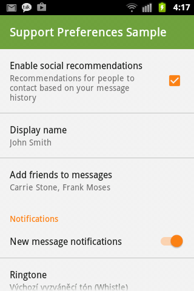
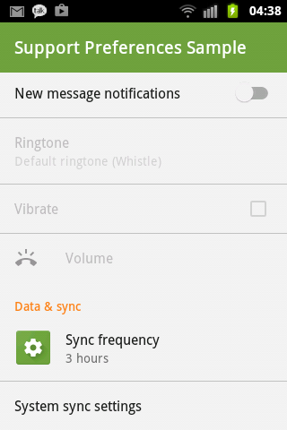
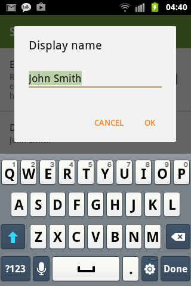
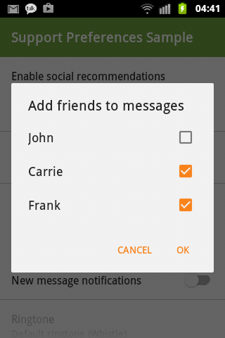
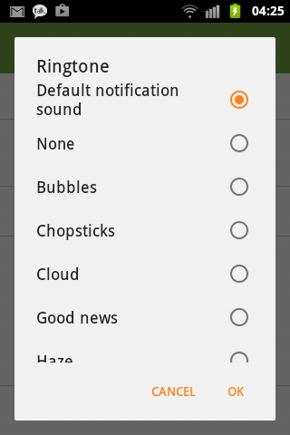
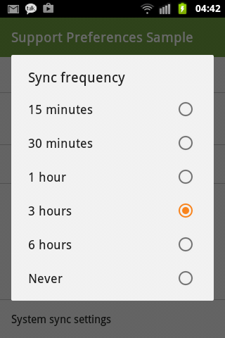

# Material Preference

Material themes for preference widgets and support preference widgets.

Available from API 7. Depends on appcompat-v7-r22.1.1.

## Screenshots

All taken from an API 10 device.

&nbsp;
&nbsp;
&nbsp;
&nbsp;
&nbsp;
&nbsp;


## Contents

- `Preference`
- `CheckBoxPreference`
- `SwitchPreference`
  - Using `SwitchCompat` available from API 7
- `DialogPreference`
  - Uses AppCompat Alert Dialog Material theme
- `EditTextPreference` extends `DialogPreference`
- `ListPreference` extends `DialogPreference`
- `MultiSelectListPreference` extends `DialogPreference`
  - Now available from API 7
- `SeekBarDialogPreference` extends `DialogPreference`
  - Made public, appropriately tinted `SeekBar`
- `RingtonePreference`
  - Extracted Ringtone Picker Activity from AOSP
  - Customizable AppCompat theme

## How to get the library?

```groovy
repositories {
    maven { url "http://dl.bintray.com/consp1racy/maven" }
}

dependencies {
    compile 'net.xpece.android:support-preference:0.3.0'
}
```

## How to use the library?

For now: Please read known issues at the bottom of this page and carefully examine the sample project.

## Changelog

**0.3.0**
- Removed `MultiCheckPreference` as it was only partially implemented and `MultiSelectListPreference` provides the same function.
- `MultiSelectListPreference` is now available since API 7 (formerly API 11). Uses `JSONArray` to persist `Set<String>`.
- API for persisting and accessing string sets since API 7 is available via `SharedPreferencesCompat`.
- `Preference`s now support `app:asp_iconPaddingEnabled` attribute which allows to better align non-launcher icons to 16dp keyline.
- Custom preferences are now recycled which fixed animation issues on Lollipop.
- Custom preferences are now always inflated on all platforms if using `AppCompatPreferenceActivity` and/or custom `PreferenceFragment`.
- Library no longer includes `android.permission.READ_EXTERNAL_STORAGE` permission (used to read ringtones). You have to do it yourself.
  - This is needed because the custom picker is part of the app and not provided by system.
  - You are of course free to use `android.preference.RingtonePreference` when necessary.

**0.2.2**
- optional tinting via `app:asp_tintIcon="true"` and `app:asp_tintDialogIcon="true"` and `asp_tint` and `asp_tintMode`.

**0.2.1**
- No need for `net.xpece.android.support.preference.` prefix in XML files defining preferences, framework will choose automatically:
  - <s>On Lollipop native `Preference`, `CheckBoxPreference`, `SwitchPreference` will be used.</s>
  - <s>Otherwise support version will be used.</s>
  - <s>Force either version by using fully qualified class name.</s>
  - You need to use `AppCompatPreferenceActivity` or special `PreferenceFragment` both of which are provided.
- <s>Added `PreferenceCompat#setChecked(Preference, boolean)` helper method.</s>

**0.1.2**
- Czech strings
- `SeekBar` in `SeekBarDialogActivity` uses `ColorFilter` to match theme

**0.1.1**
- Initial release
- Backported material style and icon capability for `Preference` children
- Backported `SwitchPreference`
- Material styled `RingtonePreference` picker dialog/activity

## Known issues

- Doesn't work well with fragment headers. Use simple preference layout as much as possible.
- Multilingual strings for Ringtone picker activity are not pulled yet.

If you want Holo seek bar on Gingerbread, copy necessary resources from SDK to your project, define
custom `Widget.Something.SeekBar` style and override `android:seekBarStyle` in your theme appropriately.
