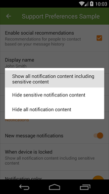
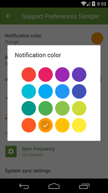
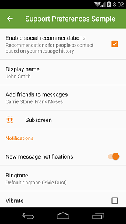
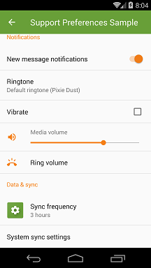

# Material Preference [ ](https://bintray.com/consp1racy/maven/net.xpece.android%3Asupport-preference/_latestVersion) [ ](https://android-arsenal.com/details/1/3267)


Material theme for preference widgets.

Backporting dat material look *and* functionality.

Available from API 7. *Connecting preference-v7 to appcompat-v7.*

## How to get the library?

```groovy
dependencies {
    compile 'net.xpece.android:support-preference:0.8.0'
}
```

## ***NEW!*** How to get color picker preference too?

```groovy
dependencies {
    compile 'net.xpece.android:support-preference-color:0.8.0'
}
```

Version of color preference artifact does not necessarily correspond to version of main library. Version 0.7.x is not compatible with 0.6.x.

## ***NEW!*** How to get just custom Material popup menu and spinner?

```groovy
dependencies {
    compile 'net.xpece.android:support-spinner:0.8.0'
}
```

## Screenshots

Library version 0.6.0. Android version 4.4.

Showcasing simple menu/dialog, custom title and summary text appearance and color picker.

&nbsp;
&nbsp;
&nbsp;

Library version 0.5.1. Android version 4.4.

&nbsp;
&nbsp;
&nbsp;
&nbsp;
&nbsp;
&nbsp;
&nbsp;
&nbsp;
&nbsp;

## Contents

- `Preference`
- `CheckBoxPreference`
- `SwitchPreference`
    - Using `SwitchCompat` available from API 7
- `DialogPreference`
    - Uses AppCompat AlertDialog Material theme
- `EditTextPreference`
- `ListPreference`
    - Optionally can display as a simple menu or simple dialog.
- `MultiSelectListPreference`
    - Available since API 7
- `SeekBarDialogPreference` extends `DialogPreference`
    - Made public
- `SeekBarPreference`
    - Made public
    - According to http://www.google.com/design/spec/components/dialogs.html#dialogs-confirmation-dialogs
- `RingtonePreference`
    - Coerced Ringtone Picker Activity from AOSP
- `ColorPreference`
    - Pillaged http://www.materialdoc.com/color-picker/
- `XpPreferenceFragment`
    - Handles proper Preference inflation and DialogPreference dialogs
- `SharedPreferencesCompat`
    - `getStringSet` and `putStringSet` methods allow persisting string sets even before API 11

## Features on top of preference-v7

- Material preference item layouts out of the box.
- Icon and dialog icon tinting and padding.
- `EditTextPreference` understands `EditText` XML attributes.
- Several preference widgets not publicly available in preference-v7 or SDK.
    - `RingtonePreference`, `SeekBarPreference`, `SeekBarDialogPreference`, `MultiSelectListPreference`
- Subscreen navigation implementation.
- `ListPreference` can optionally show as a simple menu in a popup instead of a dialog.
- `ColorPreference`

## How to use the library?

### Basic setup

Your preference fragment needs to extend `XpPreferenceFragment`.

Setup your preference items in the following method:

```java
public void onCreatePreferences2(final Bundle savedInstanceState, final String rootKey) {
    // ...
}
```

Your settings activity theme needs to specify the following values:

```xml
<style name="AppTheme" parent="Theme.AppCompat.Light.NoActionBar">
    <!-- Used to theme preference list and items. -->
    <item name="preferenceTheme">@style/PreferenceThemeOverlay.Material</item>
</style>
```

Until version 0.8.0 you also needed to define `preferenceTint` attribute:
```xml
<!-- Default preference icon tint color. -->
<item name="preferenceTint">?colorAccent</item>
```

<s>Since v0.6.1 disabled color for `preferenceTint` is computed automatically. Prior to this you'd have
to use custom `ColorStateList` XML resource with disabled state.</s>

Styling `alertDialogTheme` is recommended for a proper color theme. See the sample project.

### Dividers

Preference-v7 r23.2.0 provides a divider implementation out of the box.
If you want to customize how this divider looks you can call `setDivider(...)` and `setDividerHeight(...)`.
Preference-v7 divider will be drawn just between items and at the bottom of the list. It will not be drawn before the end of category.

If you want more control over where the dividers are drawn, disable the default implementation and use my own instead:

```java
@Override
public void onViewCreated(View view, Bundle savedInstanceState) {
    super.onViewCreated(view, savedInstanceState);
    getListView().addItemDecoration(new PreferenceDividerDecoration(getContext()).drawBottom(true));
    setDivider(null);
}
```

Preference-v7 r23.1.1 does not provide a default divider so you don't need to call `setDivider(null)`.

### Ringtone picker

`RingtonePicker` will show only system ringtones/notification sounds by default.
If you want to include sounds from the external storage your app needs to request
`android.permission.READ_EXTERNAL_STORAGE` permission in its manifest.
Don't forget to check this runtime permission before opening ringtone picker on API 23.

### Simple menu and Simple dialog

Simple menu is described in [Material Design specs](https://www.google.com/design/spec/components/menus.html#menus-simple-menus).

If you want to show your `ListPreference` in a popup instead of a dialog use this configuration:

```xml
<ListPreference
    style="@style/Preference.Material.DialogPreference.ListPreference.SimpleMenu"/>
```

Since v0.5.10: Furthermore you can either force simple menu, force simple dialog or let the system decide.
In that case simple dialog is picked when any item in the menu wraps to second line.

```xml
<ListPreference
    app:asp_menuMode="dialog|simple_menu|simple_dialog|simple_adaptive"/>
```

Menu modes:

- `dialog`: Alert dialog with radio buttons and optional title. Default behavior.
- `simple_menu`: Menu is shown in a popup window. Selected option is highlighted. Less disruptive.
- `simple_dialog`: Menu is shown in a dialog with no other controls. Selected option is highlighted.
- `simple_adaptive`: Menu is shown in a popup window if it contains only single line items. Otherwise simple dialog is shown.

The width of the popup window will try to accommodate all items and be a multiple of 56dp on phones and 64dp on tablets.
You can specify `app:asp_simpleMenuWidthUnit` attribute to override this behavior:

- `match_parent` or `wrap_content`: Same width as underlying `ListPreference` view.
- `0dp`: Popup wraps its own content (max width being limited by the width of underlying `ListPreference`).
- `Xdp`: Popup wraps its own content and expands to the nearest multiple of X (being limited by the width of underlying `ListPreference`).

### Material Spinner


New `XpAppCompatSpinner` widget is built according to
[Material Design specs](https://www.google.com/design/spec/components/menus.html#menus-behavior).

> Menus are positioned over their emitting elements such that the currently selected menu item appears on top of the emitting element.

Example setup:

```xml
<net.xpece.android.support.widget.XpAppCompatSpinner
    style="@style/Widget.Material.Spinner.Underlined"
    android:theme="ThemeOverlay.Material.Spinner"
    android:layout_width="wrap_content"
    android:layout_height="wrap_content"
    android:entries="@array/my_entries"
    app:asp_spinnerMode="dialog|dropdown|adaptive"/>
```

The above setup will ensure the following:

- Popup `ListView` will have top and bottom padding.
  - Theme overlay applied via `android:theme` directly limits its effects on this widget.
  - Is not supported by AppCompat or platform popup windows.
- `Spinner` will have proper space around its caret before API 23.
  - If using `style="@style/Widget.Material.Spinner.Underlined"` or `style="@style/Widget.Material.Spinner.Underlined"`.
  
If you need to alter entries programmatically create by `CheckedItemAdapter.newInstance(Context, CharSequence[], int)`
or supply your own adapter (responsible for its own styling) to `XpAppCompatSpinner.setAdapter(SpinnerAdapter)`.

Spinner modes:

- `dropdown`: Menu is shown in a popup window. Selected option is highlighted. Less disruptive.
- `dialog`: Menu is shown in a dialog with no other controls. Selected option is highlighted.
- `adaptive`: Menu is shown in a popup window if it contains only single line items. Otherwise simple dialog is shown.

### Color preference

Version 0.6.0 introduced color preference as a separate module. An example would look like this:

```xml
<ColorPreference
    android:defaultValue="?colorPrimary"
    android:entries="@array/colors_material_names"
    android:entryValues="@array/colors_material"
    android:key="notif_color"
    android:title="Notification color"/>

<array name="colors_material">
     <item>@color/material_red_500</item>
     <item>@color/material_light_blue_500</item>
     <item>@color/material_light_green_500</item>
     <item>@color/material_orange_500</item>
</array>

<string-array name="colors_material_names">
    <item>Red</item>
    <item>Light Blue</item>
    <item>Light Green</item>
    <item>Orange</item>
</string-array>
```

Additional attributes include:

- `app:asp_columnCount`: Specify the number of columns in the color picker. Use an integer resource which will allow you to specify greater number on tablets. Default is 4.
- `app:asp_swatchSize`: Size of individual swatches in the color picker.
  - `small`: 48dp, default.
  - `large`: 64dp.

Finally you need to make your preference fragment fire up the color picker dialog
when the preference is clicked and optionally update summary when a color is chosen.
Please review sample [`SettingsActivity.java`](sample/src/main/java/net/xpece/android/support/preference/sample/SettingsActivity.java)
and [`SettingsFragment.java`](sample/src/main/java/net/xpece/android/support/preference/sample/SettingsFragment.java) respectively.

If you need to change the default style either use `style` attribute or override it in your theme:

```xml
<item name="colorPreferenceStyle">@style/Preference.Material.DialogPreference.ColorPreference</item>
```

The color is stored internally as a 32-bit integer.

### Subscreen navigation

<s>One solution is implemented in `PreferenceScreenNavigationStrategy.ReplaceRoot` class.
This class will help you replace root preference in your preference fragment.</s>

Another solution is implemented in `PreferenceScreenNavigationStrategy.ReplaceFragment` class.
This class will help you replace the whole preference fragment with a new instance with specified root preference.
Unlike the first solution this one is using fragment transactions and back stack allowing for transition animations and saved states.

Please review the sample project and javadoc of both solutions.

### Known issues with support library

In appcompat-v7 r23.1.1 library there is a bug which prevents tinting of checkmarks in lists.
Call `Fixes.updateLayoutInflaterFactory(getLayoutInflater())` right after
`super.onCreate(savedInstanceState)` in your Activity.

```java
@Override
protected void onCreate(Bundle savedInstanceState) {
    super.onCreate(savedInstanceState);
    Fixes.updateLayoutInflaterFactory(getLayoutInflater());
    setContentView(R.layout.activity_settings);
    //...
}
```

This fix is not necessary or available since version 0.5.5.

---

You may have experienced unexpected background color which manifests as holo blue on Android 4 and grey on Android 5. This is caused by `PreferenceFragment`'s `RecyclerView` grabbing focus on fragment start. We can disable this behavior while still being able to navigate between individual preferences with a D-pad.

    @Override
    public void onViewCreated(View view, @Nullable Bundle savedInstanceState) {
        super.onViewCreated(view, savedInstanceState);
        final RecyclerView listView = getListView();

        // We don't want this. The children are still focusable.
        listView.setFocusable(false);
    }

### Icon tinting

All preferences:

- `app:asp_tint`
- `app:asp_tintMode`
- `app:asp_tintEnabled`

All dialog preferences:

- `app:asp_dialogTint`
- `app:asp_dialogTintMode`
- `app:asp_dialogTintEnabled`

### Icon padding

Application icons (48dp x 48dp) require no extra padding.
For smaller icons extra padding of 4dp on each side is needed.
Achieve this by using `app:asp_iconPaddingEnabled`
and `app:asp_dialogIconPaddingEnabled` attributes. Icon padding is enabled by default.

### Handling PreferenceScreen icons

As `PreferenceScreen` class is final and hardwired into preference system
I was unable to automate icon tinting and padding. However you are able to do this yourself:

```java
Preference subs = findPreference("subs_screen");
PreferenceIconHelper subsHelper = new PreferenceIconHelper(subs);
subsHelper.setIconPaddingEnabled(true); // Call this BEFORE setIcon!
subsHelper.setIcon(R.drawable.some_icon);
subsHelper.setTintList(ContextCompat.getColorStateList(getPreferenceManager().getContext(), R.color.accent));
subsHelper.setIconTintEnabled(true);
/* or */
PreferenceIconHelper.setup(subs /* preference */,
    R.drawable.some_icon /* icon */,
    R.color.accent /* tint */,
    true /* padding */);
```

You can use this class even on preference classes from preference-v7 package in case you're not using
`XpPreferenceFragment`.

### Proguard

Since version 0.5.1 Proguard rules are bundled with the library.

## Changelog

**Coming [soon™](http://wowwiki.wikia.com/wiki/Soon)**
- Ditto.

**0.8.0**
- *NEW!* Very much material `XpAppCompatSpinner` is now available as a standalone library.
- *FIXED:* Simple menu:
  - Correct vertical position when using asymmetric top and bottom padding on anchor.
  - Correct horizontal size when using `setDropDownMaxWidth(MATCH_PARENT)`.
  - Correct gravity in RTL configurations.
- Dropping `preferenceTint` attribute. `colorAccent` will be used for icons by default.
- `ReplaceRoot` subscreen navigation strategy now remembers precise scroll position.
- UI tweaks.

**0.7.0** *Legacy*
- `SeekBar*Preference` support `app:asp_min` attribute.
  - Preference stores a value between `app:asp_min` and `android:max`.
- `SeekBarPreference` supports `app:asp_info` attribute for a short arbitrary text such as numeric value.
- `SeekBarPreference` supports custom `OnSeekBarChangeListener`.
- UI tweaks:
  - Better aligned `CheckBox` and `Switch` widgets to 16dp right keyline.
  - Using native `Switch` on API >= 21.
    - Supports animation on toggle.
    - *May change back any time!*
  - Better aligned `SeekBar` in `SeekBar*Preference`.
- *FIXED:* `SeekBarDialogPreference` dialog now never shows icon in title region.
- *FIXED:* `SeekBarDialogPreference` dialog now supports `android:dialogMessage`.
- *FIXED:* `SeekBarPreference`'s `SeekBar` now shows up in proper state on Android 2.
- `ReplaceRoot` subscreen navigation strategy:
  - Remembers first visible child upon re-entering previous screen.
  - Is now deprecated. Please use `ReplaceFragment` instead.
- `ColorPreference` dialog will automatically calculate column count if `app:asp_columnCount="-1"`.

**0.6.2** *Legacy*
- *FIXED:* Finally fixed simple menu position - no more arbitrary numbers + more effective.
- *FIXED:* Simple menu animation looks closer to platform default on Android 4.
  - Override `Animation.Asp.Popup` to change this behavior.
- *FIXED:* Better `SeekBarPreference` layout height on Android 6.

**0.6.1** *Deprecated*
- *FIXED:* Dialog preferences respect `alertDialogTheme` when inflating icons and layouts.
- *FIXED:* When using simple color for `preferenceTint` disabled state is computed automatically.

**0.6.0** *Deprecated*
- *NEW!* `ColorPreference` available as a separate module!
- *NEW!* `ReplaceFragment` subscreen navigation strategy allowing for fragment transition animations.
- Minor fixes.

**0.5.11** *Deprecated*
- *FIXED:* Focused `SeekBarPreference` can now be controlled by `+` and `-` keys.
- *FIXED:* Simple menu.
  - Popup will now display correctly for various item counts in various positions.
  - Popup is clipped to parent recycler view with a 16dp margin as suggested by MD.
  - Limit: Simple menu is now disabled before Android 4. Falls back to simple dialog.
  - Limit: Displaying popup will not make parent recycler view scroll.

**0.5.10** *Deprecated*
- *NEW!* Simple dialog variant of `ListPreference`. See above for instructions.
- *FIXED:* Simple menu.
  - Fixed simple menu height when using multiline items.
  - Centering multiline item over anchor view when using simple menu.
- *FIXED:* Recycling items with custom text appearance or text color.

**0.5.9** *Deprecated*
- *FIXED:* Simple menu.
  - Showing simple menu is restored after screen orientation change.
  - Aligning simple menu width to 56dp/64dp grid on phones/tablets (customizable).

**0.5.8** *Deprecated*
- *FIXED:* Simple menu.
  - Preselected option is now highlighted.
  - Fixed animation on Android 4 - fading in.
  - Fixed popup width on Android 4.
  - Two line items now have top and bottom padding.

**0.5.6** *Deprecated*
- *NEW!* Custom title and summary text styles.
  - `app:titleTextAppearance` and `app:titleTextColor` for titles.
  - `app:subtitleTextAppearance` and `app:subtitleTextColor` for summaries.
  - Analogous methods available in Java.
- *FIXED:* Simple menu.
  - Popup window adjusts its width according to its own content.
  - Added top and bottom padding to popup window.
  - Items can have up to two lines of text (increased form one).
  - Added persistent scrollbar if all items don't fit on screen.

**0.5.5** *Deprecated*
- ***Only supports appcompat-v7 with preference-v7 version 23.2.x!***

**0.5.4** *Legacy*
- ***Last version that supports appcompat-v7 with preference-v7 version 23.1.1!***
- *NEW!* Simple menu variant of `ListPreference`.
  - Via `app:asp_simpleMenu="true"`.
  - Described here https://www.google.com/design/spec/components/menus.html#menus-simple-menus
  - Does not have top and bottom padding yet.
  - Menu position is unpredictable when having more than 3 menu items and the preference is first or last in the list.
  - To be updated later.
- *FIXED:* Small icon is properly aligned in RTL configurations.

**0.5.3** *Deprecated*
- *FIXED:* Ringtone picker does not *need* `READ_EXTERNAL_STORAGE` permission even prior to Android 6.

**0.5.2** *Deprecated*
- *FIXED:* `PreferenceScreenNavigationStrategy.ReplaceRoot` no longer crashes on screen rotation.
- *FIXED:* Ringtone picker does not stop playback on screen rotation.

**0.5.1** *Deprecated*
- *NEW!* `PreferenceScreenNavigationStrategy` class.
- *FIXED:* Missing Proguard rules are now bundled with the library.
- *FIXED:* Incorrect icon size on Lollipop.

**0.5.0** *Deprecated*
- ***Only supports appcompat-v7 with preference-v7 version 23.1.1!***
- *NEW!* Based on preference-v7 instead of native preferences.
- Updated appcompat-v7 library to 23.1.1.
    - Material SeekBar style across all platforms.
- `RingtonePreference` is now `DialogFragment` based.
- Unmanaged preference icons (such as that of `PreferenceScreen`) can be tinted via `PreferenceIconHelper`.
- Default preference icon tint specified by `preferenceTint` theme attribute.
- Fixed divider color.
- Sample contains `PreferenceScreen` subscreen handling.

**0.4.3** *Legacy*
- ***Last fully supported appcompat-v7 version is 23.0.1. After that ringtone picker crashes!***
- No more `Resources.NotFoundException` in `RingtonePickerActivity`. Falls back to English.
- Updated appcompat-v7 library to 22.2.1.

**0.4.2** *Deprecated*
- <s>`SeekBar` tinting can be turned off via `app:asp_tintSeekBar="false"`</s>
- Introduced missing `seekBarDialogPreference` style

**0.4.1** *Deprecated*
- Ringtone picker strings are now taken dynamically from `android` and `com.android.providers.media` packages, falls back to English
    - <s>These are accessible via `RingtonePickerActivity.get*String(Context)`</s>

**0.4.0** *Deprecated*
- *NEW!* Implemented SeekBarPreference according to http://www.google.com/design/spec/components/dialogs.html#dialogs-confirmation-dialogs
- *FIXED:* tinting/padding in DialogPreference and SeekBarDialogPreference
- <s>AppCompatPreferenceActivity and PreferenceFragment now implement Factory<Preference></s>
- *NEW!* app:asp_dialogIconPaddingEnabled attribute

**0.3.0** *Deprecated*
- Removed `MultiCheckPreference` as it was only partially implemented and `MultiSelectListPreference` provides the same function.
- `MultiSelectListPreference` is now available since API 7 (formerly API 11). Uses `JSONArray` to persist `Set<String>`.
- API for persisting and accessing string sets since API 7 is available via `SharedPreferencesCompat`.
- `Preference`s now support `app:asp_iconPaddingEnabled` attribute which allows to better align non-launcher icons to 16dp keyline.
- <s>Custom preferences are now recycled which fixed animation issues on Lollipop.</s>
- Custom preferences are now always inflated on all platforms if using `AppCompatPreferenceActivity` and/or custom `PreferenceFragment`.
- Library no longer includes `android.permission.READ_EXTERNAL_STORAGE` permission (used to read ringtones). You have to do it yourself.
    - This is needed because the custom picker is part of the app and not provided by system.
    - <s>You are of course free to use `android.preference.RingtonePreference` when necessary.</s>

**0.2.2** *Deprecated*
- optional tinting <s>via `app:asp_tintIcon="true"` and `app:asp_tintDialogIcon="true"` and `asp_tint` and `asp_tintMode`</s>.

**0.2.1** *Deprecated*
- No need for `net.xpece.android.support.preference.` prefix in XML files defining preferences, framework will choose automatically:
    - <s>On Lollipop native `Preference`, `CheckBoxPreference`, `SwitchPreference` will be used.</s>
    - <s>Otherwise support version will be used.</s>
    - <s>Force either version by using fully qualified class name.</s>
    - <s>You need to use `AppCompatPreferenceActivity` or special `PreferenceFragment` both of which are provided.</s>
- <s>Added `PreferenceCompat#setChecked(Preference, boolean)` helper method.</s>

**0.1.2** *Deprecated*
- Czech strings
- `SeekBar` in `SeekBarDialogActivity` uses `ColorFilter` to match theme

**0.1.1** *Deprecated*
- Initial release
- Backported material style and icon capability for `Preference` children
- Backported `SwitchPreference`
- Material styled `RingtonePreference` picker dialog/activity

## Known issues

- SwitchPreference does not animate its SwitchCompat widget when clicked.
  - https://code.google.com/p/android/issues/detail?id=196652
  - This is hotfixed in v0.7.0 on Android 5 or later by using native `Switch` instead of `SwitchCompat`. This may introduce other problems along the way so don't rely on this change.
- MultiSelectListPreference items may be incorrectly tinted on Android 2.
  - Observed on Android 4 as well on first opening of multi select dialog.
- SeekBarPreference's SeekBar may appear in disabled state until clicked on Android 2.
  - This is hotfixed in v0.7.0 by manually refreshing each of `SeekBar` drawables upon entering screen. This does not affect seek bars outside `SeekBarPreference`.

## Questions

- Why are some of your classes in `android.support.v7` packages?
    - I'm using their package private features to achieve consistent results.

## Credit

Most of this library is straight up pillaged latest SDK mixed with heavy reliance on appcompat-v7. Since version 0.5.0 the same applies to preference-v7. Kudos to people who create and maintain these!
